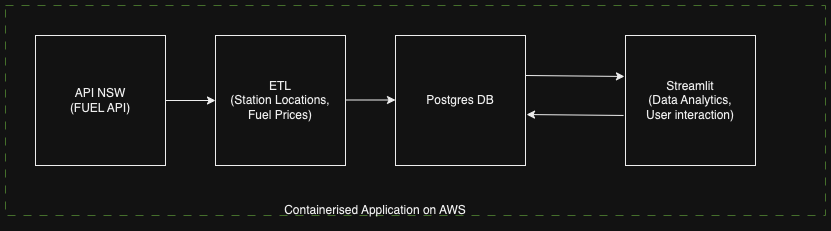
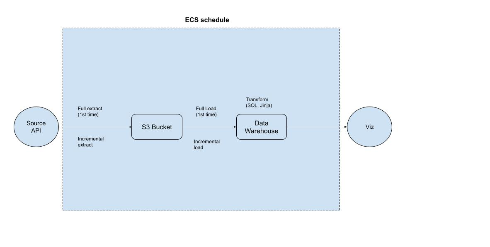
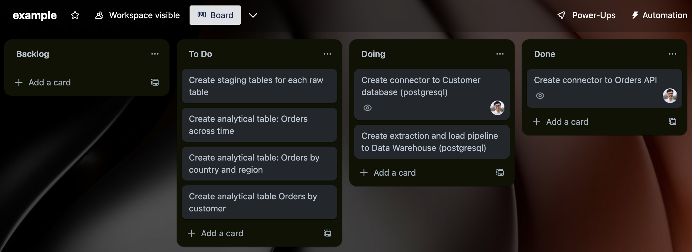

# Project plan 

## Objective 
The objective of our project is to provide data analytics to the Fuel prices across NSW (and probably other states in Australia).
Using NSW Fuel API as a start.

## Consumers 
People can query the prices of fuel in their states or near their location. They can also have a look at other statistics of the fuel prices (e.g maximum vs median prices) and compare between locations to find the cheapest price.

## Questions 
What questions are you trying to answer with your data? How will your data support your users?

Example: 

\begin{itemize}
- What are the ranges of fuel prices at a particular suburb?
- Which suburbs have the most expensive/ most affordable fuel price in NSW?
- When is the appropriate time of the week to re-fuel your vehicle? (is there a seasonal trend in the fuel price?)
- What is the cheapeast fuel option in my area?

\end{itemize}

## Source datasets 

Fuel API from https://api.nsw.gov.au/ 

## Solution architecture

## Breakdown of tasks 
How is your project broken down? Who is doing what?

We recommend using a free Task board such as [Trello](https://trello.com/). This makes it easy to assign and track tasks to each individual. 

Example: 

